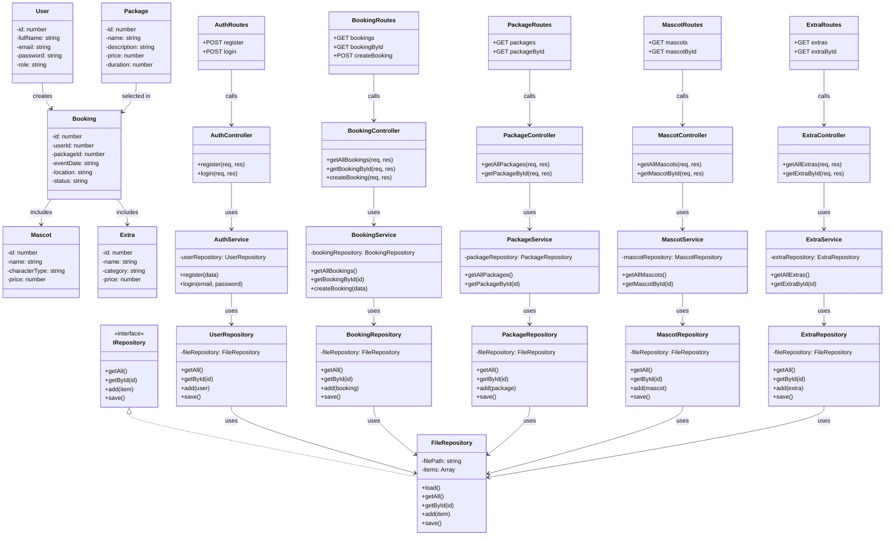

# Class Diagram

This class diagram documents the main architectural components of the **MD Creative – Smart Event & Booking Management System**.

It reflects the layered backend structure of the project:
- **Models** for domain entities
- **Repositories** for data access and persistence
- **Services** for business logic
- **Controllers** for request handling
- **Routes** for API endpoint exposure

---

## UML Class Diagram

---

# Relationships Summary
- A User can create one or more Bookings
- A Booking is linked to one selected Package
- A Booking may include multiple Mascots
- A Booking may include multiple Extras
- Routes forward API requests to controllers
- Controllers handle incoming HTTP requests and responses
- Services contain business logic
- Repositories manage data access and CSV/file persistence
- FileRepository provides reusable file-based storage operations
- IRepository defines the common repository contract

---

# Notes
## This diagram was designed to match the project architecture and to reflect the separation of concerns between:
- presentation and request handling
- business logic
- data access and persistence
- domain modeling

**It also documents the applied Repository Pattern in a clean and professional way.**

---