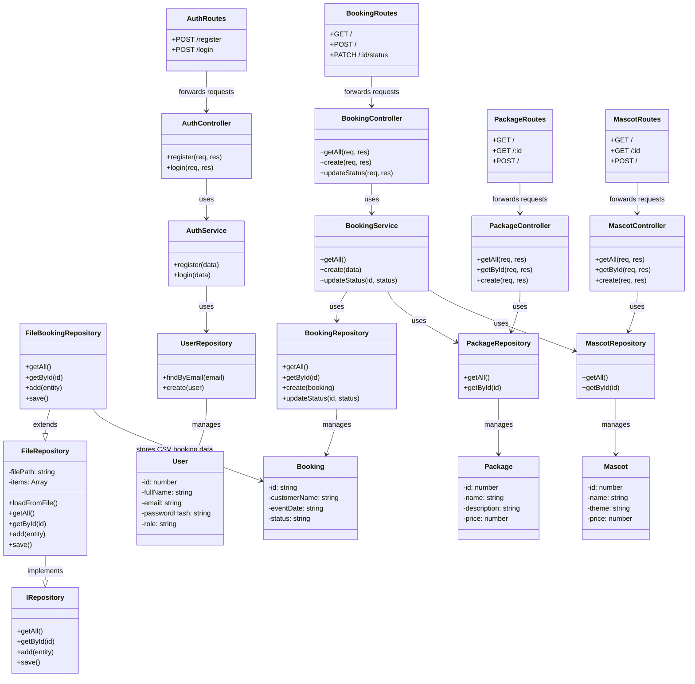

# UML Class Diagram

This class diagram presents the main architectural components of the **MD Creative – Smart Event & Booking Management System**.

It reflects the layered backend structure of the project:
- Models for domain entities
- Repositories for data access and persistence
- Services for business logic
- Controllers for request handling
- Routes for API exposure
- Repository Pattern with CSV file support through `IRepository` and `FileRepository`

---

## UML Class Diagram

---

# Relationships Summary
This system defines several important relationships between components and entities:
- Routes → Controllers (1:1 interaction)
Each route forwards HTTP requests to the corresponding controller responsible for handling them.
- Controllers → Services / Repositories
Controllers delegate logic to services (business logic) or directly to repositories (data access in simpler modules).
- Services → Repositories
Services coordinate data operations by interacting with one or multiple repositories.
- Repositories → Models (1:N)
Each repository manages persistence operations for its corresponding domain entity.
- FileRepository → IRepository (inheritance)
The FileRepository implements the generic contract defined by IRepository.
- FileBookingRepository → FileRepository (inheritance)
A specialized repository used for handling booking data stored in CSV files.
- BookingRepository → Booking
Handles database persistence for booking entities (PostgreSQL-based).
- UserRepository → User
Manages user-related data including authentication queries.
- PackageRepository → Package
Provides access to package-related data.
- MascotRepository → Mascot
Provides access to mascot-related data.

---

# Notes on Relationships
Some parts of the architecture combine different persistence approaches:

- Database repositories (e.g., BookingRepository) are used for primary data storage (PostgreSQL).
- File-based repositories (e.g., FileBookingRepository) are used to demonstrate CSV persistence and the Repository Pattern.

This hybrid approach is intentional and serves educational purposes, showing how different storage strategies can coexist within the same system.

---

# Notes
This diagram reflects the current backend architecture and highlights the separation of concerns between:
- request handling (Routes & Controllers)
- business logic (Services)
- data access (Repositories)
- data models (Entities)

It also clearly demonstrates the use of the Repository Pattern through IRepository, FileRepository, and its concrete implementations.

---