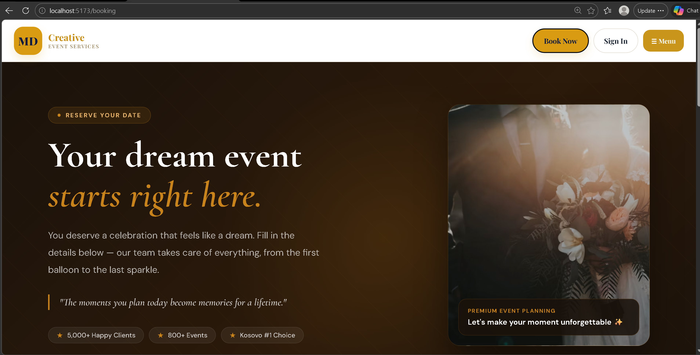
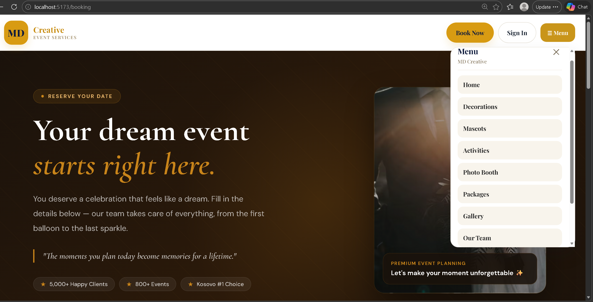
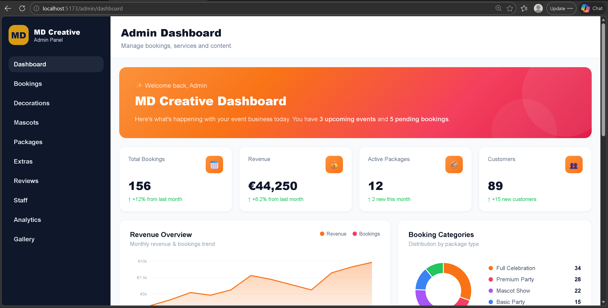
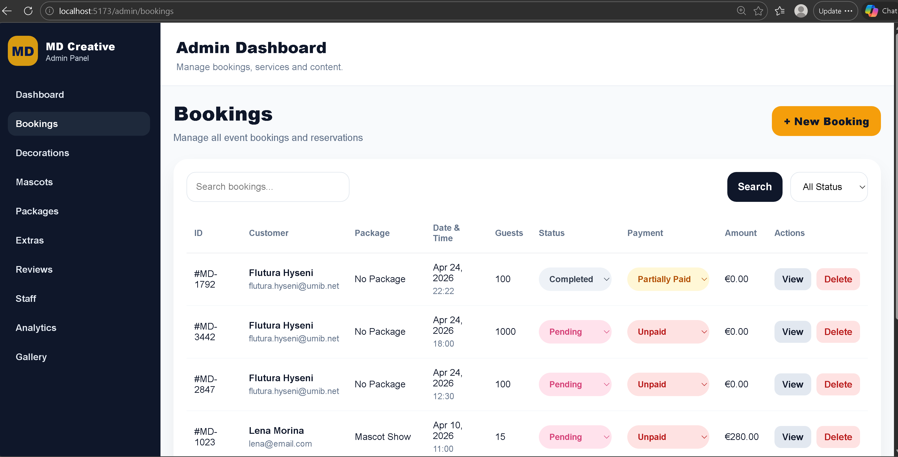
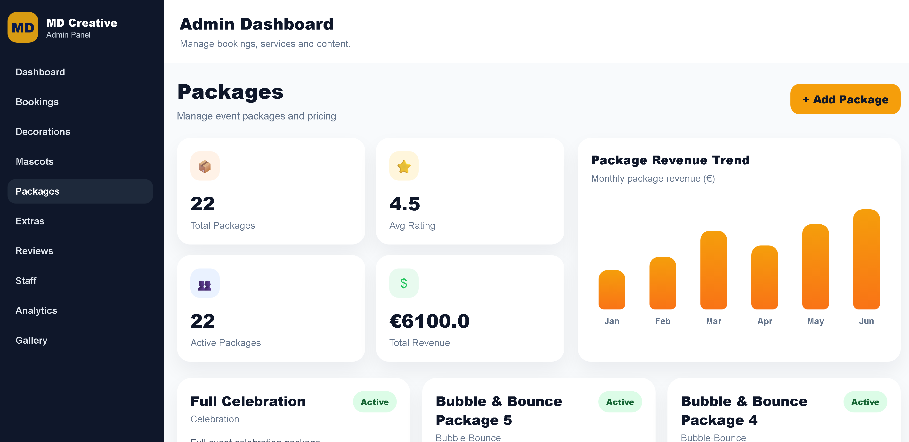

# Improvement Evidence – MD Creative Event Booking System

This document provides visual evidence of the improvements implemented
during the improvement sprint. Each screenshot demonstrates a specific
part of the system that was improved or connected to the real backend.

---

## 1. Public-Facing System

### Homepage
The public homepage presents the business clearly with navigation,
call-to-action buttons, and a professional layout.

---

### Booking Page
The booking form allows customers to submit real event requests
that are processed and stored through the backend API.

---

### Navigation Menu
The navigation menu connects all public pages including Decorations,
Mascots, Activities, Photo Booth, Packages, Gallery, and Our Team —
all of which are connected to real backend data after the improvements.

---

## 2. Admin Panel

### Admin Dashboard
The admin dashboard displays live statistics including total bookings,
revenue, active packages, and customer count. It also includes a
revenue trend chart and booking category breakdown — all loaded
from the real database.

---

### Admin Bookings Management
The bookings page shows real booking records loaded from the database.
Admins can view booking details, update booking status, update payment
status, and delete bookings. This page was fully connected to the
backend during the improvement sprint.

---

### Admin Packages Management
The packages page shows all active packages with revenue statistics
and a monthly revenue trend chart. Admins can create, update, and
delete packages through a fully connected backend CRUD flow.

